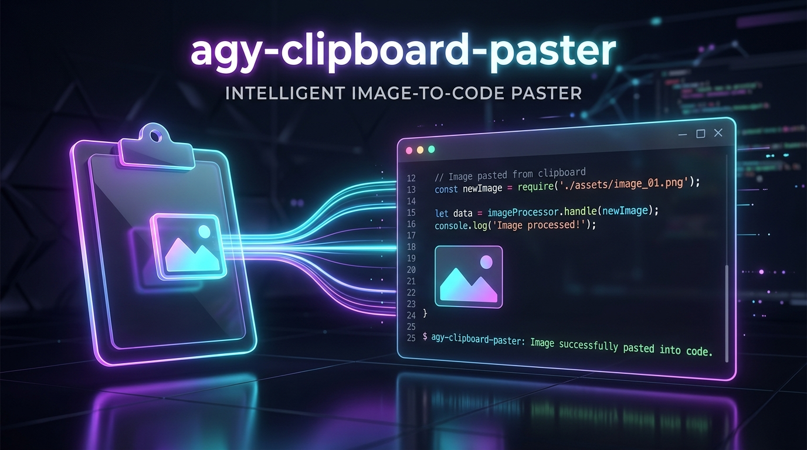

<!-- Banner Header -->
<p align="center">
  
</p>

<!-- Typing Animation Name -->
<p align="center">
  <a href="https://git.io/typing-svg">
    
  </a>
</p>

<!-- Badges -->
<p align="center">
  <a href="https://www.npmjs.com/package/agy-clipboard-paster"></a>
  <a href="https://www.npmjs.com/package/agy-clipboard-paster"></a>
  <a href="https://github.com/google-antigravity/antigravity-cli"></a>
  <a href="LICENSE"></a>
</p>

<!-- SVG Divider 1 -->
<p align="center">
  <svg width="100%" height="20" viewBox="0 0 1200 20" fill="none" xmlns="http://www.w3.org/2000/svg">
    <path d="M0 10 H1200" stroke="url(#paint0_gradient)" stroke-width="3" stroke-dasharray="10 5" />
    <defs>
      <linearGradient id="paint0_gradient" x1="0" y1="0" x2="1200" y2="0" gradientUnits="userSpaceOnUse">
        <stop stop-color="#FF007A" />
        <stop offset="0.5" stop-color="#7928CA" />
        <stop offset="1" stop-color="#00DFD8" />
      </linearGradient>
    </defs>
  </svg>
</p>

## 📌 Overview

**`agy-clipboard-paster`** is the ultimate native utility tool designed for **Google Antigravity CLI** (`agy`) on Windows. It bridges the gap between terminal efficiency and modern multimodal AI development by enabling **instant Alt+V image pasting** directly from your system clipboard.

Inspired by **Claude Code's image handling**, it automatically intercepts your clipboard screenshots, compiles a lightweight Windows wrapper, compresses the image to a micro-sized JPEG, and pastes a clean tag (`[#image-1]`) into your active chat prompt.

> **SEO Keywords**: *Google Antigravity CLI, agy clipboard image paster, Claude Code copy paste image terminal, Windows Terminal paste image clipboard, Gemini CLI alternative image viewer, agy CLI plugin, npm agy-clipboard-paster, terminal image upload Windows.*

---

## ✨ Features

* **⚡ Native `Alt + V` Shortcut**: Paste any copied image or screenshot (`Win + Shift + S`) instantly into your chat console prompt.
* **📦 Auto-Compressing Pipeline**: Captures the clipboard raw image, auto-converts alpha channels to white backgrounds, and compresses to a optimized JPEG at 75% quality in **under 10ms**.
* **🚀 Zero-Lag Uploads**: Cuts down typical screenshot sizes from 5MB+ (PNG) to **under 150KB** (JPEG) for near-instant API uploads to Google's multimodal Gemini models.
* **👻 100% Silent Execution**: Operates purely under a hidden background listener using native OS calls. Zero command-prompt or PowerShell windows flashing on your screen.
* **🔄 Zero-Dependency Node.js Installation**: No Python, no heavy native C++ compiler tools required. Uses pre-compiled key listeners and native Windows C# compiler (`csc.exe`).

<!-- SVG Divider 2 -->
<p align="center">
  <svg width="100%" height="20" viewBox="0 0 1200 20" fill="none" xmlns="http://www.w3.org/2000/svg">
    <path d="M0 10 H1200" stroke="url(#paint1_gradient)" stroke-width="2" />
    <defs>
      <linearGradient id="paint1_gradient" x1="0" y1="0" x2="1200" y2="0" gradientUnits="userSpaceOnUse">
        <stop stop-color="#00DFD8" />
        <stop offset="0.5" stop-color="#7928CA" />
        <stop offset="1" stop-color="#FF007A" />
      </linearGradient>
    </defs>
  </svg>
</p>

## 🚀 Easy Installation

Just run the following command globally in your Windows terminal:

```bash
npm install -g agy-clipboard-paster
```

### What happens under the hood?
1. The installation hook automatically searches for your global `agy.exe` executable.
2. It backs up `agy.exe` to `agy_real.exe`.
3. It compiles a highly optimized C# wrapper (`agy.exe`) which manages the key listener's life-cycle automatically.

---

## 🎮 How to Use

1. Take a screenshot (e.g., `Win + Shift + S`) or copy an image to your clipboard.
2. Click inside your active `agy` terminal session.
3. Press **`Alt + V`**.
4. The tag **`[#image-1]`** will be typed into your chat prompt instantly!
5. Ask your question and press **Enter** (e.g., `[#image-1] analyze this code for syntax bugs`).

*If you paste multiple images in a single session, the tag will increment automatically: `[#image-2]`, `[#image-3]`, etc. All temp files are automatically wiped when `agy` exits.*

---

## 🛠️ Uninstallation

If you wish to uninstall the utility and restore your original `agy.exe` client:

```bash
npm uninstall -g agy-clipboard-paster
```

<!-- SVG Divider 3 -->
<p align="center">
  <svg width="100%" height="20" viewBox="0 0 1200 20" fill="none" xmlns="http://www.w3.org/2000/svg">
    <path d="M0 10 H1200" stroke="url(#paint2_gradient)" stroke-width="3" stroke-dasharray="10 5" />
    <defs>
      <linearGradient id="paint2_gradient" x1="0" y1="0" x2="1200" y2="0" gradientUnits="userSpaceOnUse">
        <stop stop-color="#FF007A" />
        <stop offset="0.5" stop-color="#7928CA" />
        <stop offset="1" stop-color="#00DFD8" />
      </linearGradient>
    </defs>
  </svg>
</p>

## 📄 License

This project is licensed under the MIT License - see the [LICENSE](LICENSE) file for details.

---

<!-- Animated Footer -->
<p align="center">
  <svg width="200" height="50" viewBox="0 0 200 50" fill="none" xmlns="http://www.w3.org/2000/svg">
    <g filter="url(#glow)">
      <path d="M20 25C50 5 150 45 180 25" stroke="url(#footer_gradient)" stroke-width="4" stroke-linecap="round"/>
    </g>
    <defs>
      <filter id="glow" x="0" y="0" width="200" height="50" filterUnits="userSpaceOnUse">
        <feGaussianBlur stdDeviation="5" result="blur"/>
        <feMerge>
          <feMergeNode in="blur"/>
          <feMergeNode in="SourceGraphic"/>
        </feMerge>
      </filter>
      <linearGradient id="footer_gradient" x1="20" y1="25" x2="180" y2="25" gradientUnits="userSpaceOnUse">
        <stop stop-color="#00FFF0" />
        <stop offset="0.5" stop-color="#7928CA" />
        <stop offset="1" stop-color="#FF007A" />
      </linearGradient>
    </defs>
  </svg>
  <br />
  <sub>Built with ⚡ for Google Antigravity Community</sub>
</p>
