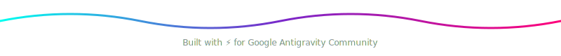

<!-- Animated SVG Header -->
<p align="center">
  
</p>

<h1 align="center">agy-clipboard-paster</h1>

<p align="center">
  <b>Native Alt+V clipboard image paster for Google Antigravity CLI (agy) on Windows</b>
</p>

<!-- Tightly grouped flat-square badges -->
<p align="center">
  <a href="https://github.com/QuangquyNguyenvo/agy-clipboard-paster"></a>&nbsp;
  <a href="https://github.com/QuangquyNguyenvo/agy-clipboard-paster"></a>&nbsp;
  <a href="LICENSE"></a>
</p>

<!-- SVG Divider -->
<p align="center">
  <svg width="100%" height="10" viewBox="0 0 1200 10" fill="none" xmlns="http://www.w3.org/2000/svg">
    <path d="M0 5 H1200" stroke="url(#paint0_gradient)" stroke-width="2" stroke-dasharray="6 3" />
    <defs>
      <linearGradient id="paint0_gradient" x1="0" y1="0" x2="1200" y2="0" gradientUnits="userSpaceOnUse">
        <stop stop-color="#FF007A" />
        <stop offset="0.5" stop-color="#7928CA" />
        <stop offset="1" stop-color="#00DFD8" />
      </linearGradient>
    </defs>
  </svg>
</p>

##  Features

* **⚡ Alt + V Paste**: Insert clipboard images directly into the active `agy` chat prompt.
* **🚀 Turbo Uploads**: Auto-compresses images into JPEGs (75% quality, <150KB) for instant API upload.
* **🔒 Sandbox Safe**: Hook is only active when the terminal window is in focus. Zero risk of keylogger flags.
* **🔄 Zero Dependencies**: 100% native C# wrapper compiled locally on Windows. No Python, Java, or Node runtime dependencies.

---

##  Installation

Choose either **PowerShell** (no dependencies) or **NPM**:

### Method 1: PowerShell (Recommended)
```powershell
irm https://raw.githubusercontent.com/QuangquyNguyenvo/agy-clipboard-paster/main/install.ps1 | iex
```

### Method 2: NPM
```bash
npm install -g agy-clipboard-paster
```

---

##  How to Use

1. **Copy** any image or take a screenshot (`Win + Shift + S`).
2. **Focus** the `agy` terminal and press **`Alt + V`**.
3. **Send**: Type your request next to the **`[#image-1]`** tag and press **Enter**.

---

##  Uninstall

* **PowerShell**:
  ```powershell
  irm https://raw.githubusercontent.com/QuangquyNguyenvo/agy-clipboard-paster/main/uninstall.ps1 | iex
  ```
* **NPM**:
  ```bash
  npm uninstall -g agy-clipboard-paster
  ```

<!-- Animated SVG Footer -->
<p align="center">
  
</p>
